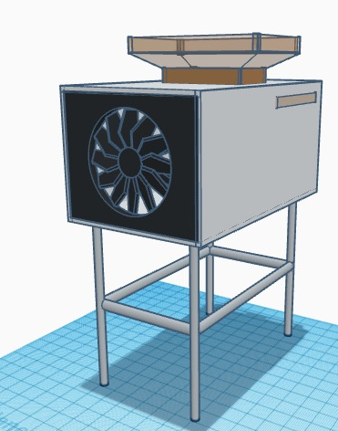
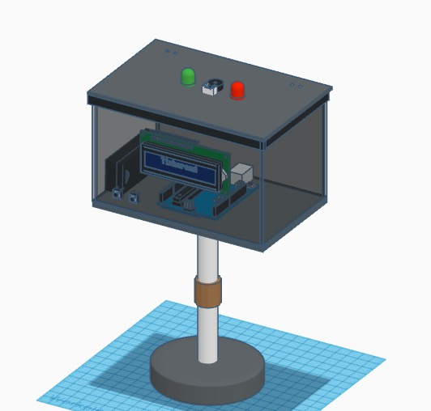
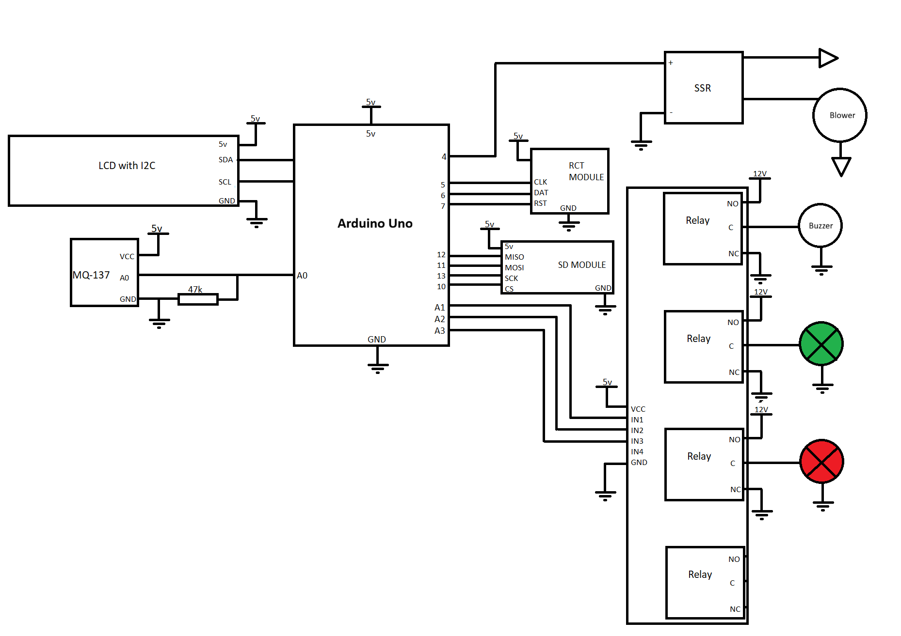

## **Description**
This Arduino system monitors ammonia gas levels using a sensor, calculates its concentration in ppm, and automatically activates a blower, alarm buzzer, and warning lights when levels exceed safe thresholds, while logging time-stamped data to an SD card to help control and track hazardous gas conditions.

## **3D Design**

## **Wiring Diagram**

## **Components**
1pc Arduino Uno
1pc 220VAC Blower
1pc 12VDC Buzzer
1pc 12VDC Green Light Bulb
1pc 12VDC Red Light Bulb
1pc 4channel Relay
1pc SD card Module
1pc RTC module
1pc LCD with I2C
1pc MQ-137 module
